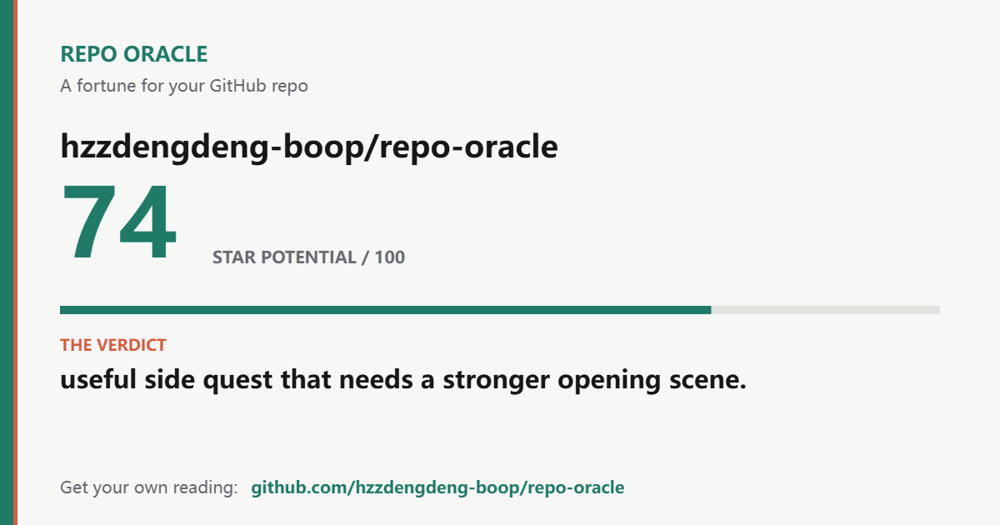

# Repo Oracle

A quick, slightly ruthless checkup for your GitHub repo.

Paste a public repo URL. Repo Oracle reads the README and public GitHub signals,
then gives you a score, a roast, and three concrete fixes. No account or API key.
The score now includes a visible signal checklist, so you can see exactly what
passed instead of trusting a mystery number.

[Try it live](https://hzzdengdeng-boop.github.io/repo-oracle/) or
[see a sample report](examples/sample-report.md).



Reports have shareable links, and you can download a 1200 x 630 PNG card.
If GitHub's API is rate-limited, the app switches to a clearly labeled
README-only reading instead of guessing at unavailable repo statistics.

## Why This Exists

Most README checkers hand you a list of missing headings. Repo Oracle turns
the same first-impression audit into something you might actually share, with
fixes you can make in ten minutes.

## Run It Locally

Open `index.html` in a browser, or serve the folder with any static server:

```bash
python -m http.server 8080
```

Then visit:

```text
http://localhost:8080
```

Run the analyzer checks with `node --test`.

## What It Checks

- clear one-line positioning
- install and quickstart sections
- usage examples
- screenshots, GIFs, or demo links
- license, topics, stars, issues, and recent updates
- README length and first-screen clarity
- shareable personality and growth advice
- permalinked reports with native device sharing
- downloadable fortune cards

## Project Shape

```text
repo-oracle/
  index.html
  styles.css
  src/
    app.js
    analyzer.js
    fortunes.js
    share-card.js
  examples/
    fortune-card.png
    sample-report.md
```

## Roadmap

- Add CLI mode: `npx repo-oracle owner/repo`
- Add GitHub Action comments for README reviews
- Add AI-assisted deep reviews as an optional mode
- Build a public gallery of memorable repo fortunes

## License

MIT
